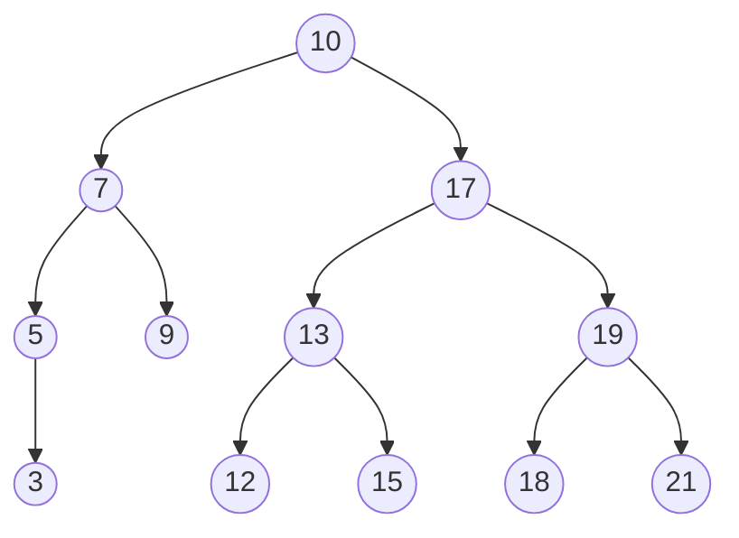

# Binärer Suchbaum
-> _BST_

-> ein [[(Binäre) Baumstrukturen|binärer Baum]] für den gilt, dass alle Knoten im

- <mark style="background: #FF5582A6;">linken Unterbaum</mark> einen <mark style="background: #FF5582A6;">kleineren Schlüssel</mark>
- <mark style="background: #ADCCFFA6;">rechten Unterbaum</mark> einen <mark style="background: #ADCCFFA6;">größeren Schlüssel </mark>

als die **(Unter)Wurzel** besitzen. Nach dem Prinzip der [[Binäre Suche|binären Suche]].

Der Schlüssel wird hier im Knoten gespeichert! Vereinfacht kann man **Key = Data** annehmen, wobei der Key eindeutig sein muss.

----------------------------------------
**Beispiel**:

M = {10, 7, 5, 17, 19, 3, 9, 13, 21, 12, 15, 18}

## Operationen

* insert(Node n)
* delete(Node n)
* find(Key k)
* print(Tree)

Im **worst-case** haben _insert/delete/find_ eine Laufzeit von $$\mathcal{O(n)}$$

-----------------

#### ***Pseudocode** zum Einfügen einer Node:

***Gegeben***: ein **BST T** und ==einzusortierendes== **Element x**
***Rückgabe***: Der **BST T** mit ==einsortiertem== **Element x**

**Function BSTinsert(T,x)**
_if_ ==T.root=NULL== _then_
T.root=Node(x);
_else if_ ==x>T.root.data== _then_
T.root.right -> <mark style="background: #CACFD9A6;">BSTinsert</mark> (T.root.right,x);
_else_
T.root.left -> <mark style="background: #CACFD9A6;">BSTinsert</mark> (T.root.left,x);
_return_ root;

------------------------

