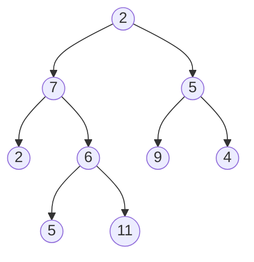

# Binärer Suchbaum
-> **gerichteter Graph**, entweder **leer** oder mit **genau zwei** Verstrebungen zu Unterbäumen.

## Terminologie

#### Blätter
-> Knoten, deren Äste **null** sind (Sackgassen)

#### Root
-> Oberste Wurzel des Baumes

#### Höhe
-> Anzahl der Knoten des Baumes

-----------------

**Beispiel:

